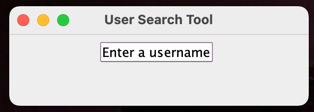
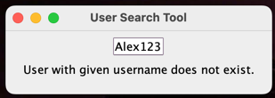
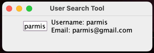
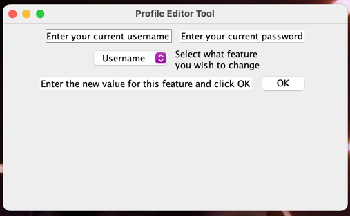
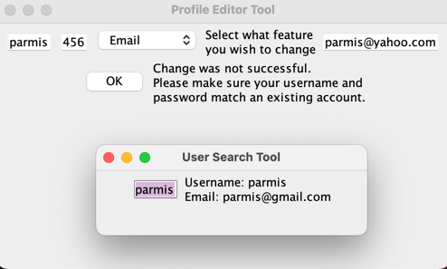
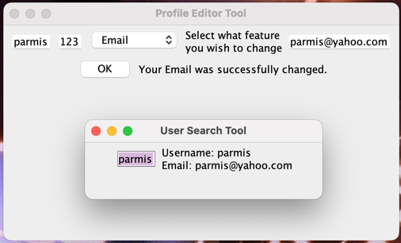
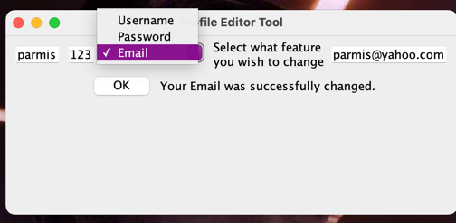

# SOLID Chat

## Notes to the Reader

### Running the Application
The entry point of the application is screens/user_registration_screen/LoginRegisterScreen.java.

If you encounter an error mentioning serialUID, please delete the existing storage file user_accounts (in the outermost folder) and we apologize for this.

Many individual screens can also be ran, including a chat with additional features (message styling and emojis) at use_cases/emoji_manager/ChatFrame.java.

### Test Coverage

A summary of the test coverage is below. To view a full report, please open the file full-test-coverage-report.html.

### Conversation History (James)
- I focused my time on following clean architecture and design but did not satisfy all the points in my feature specification. These include making ChatView (the chat UI) display previous conversation history. Although ConvHistInteractor and its interface adapters were built for this purpose, they were not connected to the UI and permanent file storage.
- Several design-related issues were created to provide directions for future refactoring of the conversation history feature

## Feature Overview / UI Screenshots
### Chat UI
- By Nasim, James, and Amy
- The UI is rendered by ChatView
- This view will appear when a user creates a new chat or visits an existing chat

### Profile display
- By Parmis
- Implemented by UserSearchUI, which allows a user to type in a user's username to view their features (user and username so far).
- User information is captured using UserPresenter interface, which uses UserDatabse's interface UserRetriever to retrieve the user of interest, then UserReader reads features of the reader that are eventually presented:
- 
- Here, Alex123 is not a user of the chat system:
- 
- parmis is a user of the chat system though:
- 

### Profile feature modification
- By Parmis
- Implemented by UserMdoificationUI, which allows a user to verify their authority to access their account by confirming their username and password, and then choosing the feature they wish to modify, and enter the new value for it. 
- User information is captured using ChangeController interface, which uses UserDatabse's interface UserRetriever to retrieve the user of interest. Then, UserAuthenticationI confirms user's authority to make the change, then we use Changeable interface (use case) to make the changes to the User entity, and finally use UserModificationGateway to relay the changed info to UserDatabase:
- 
- Here: Parmis's password is actually 123, so she doesn't get the chance to change her email:
- 
- as you can see, her email is unchanged.
- now she enters the right password and tries again:
- 
- This time, change was successful. She could use this tool to similarly change her username or password too:
- 

### App Screen UI
- By Amy
- The AppScreen UI is the screen that acts as a proxy between the user's login screen and their individual chats.
- Upon logging in, a user will will be rendered with a view of AppScreen.
- App screen provides a dashboard of buttons containing a user's existing chats, and the order that these chats appear will update whenever a new message or chat is recieved/created.

- Each chat button will also display a date indicating the date of the last message in a chat's conversation history, or no date if a chat has no messages 
- ChatView (the window referenced above) will open upon clicking an existing chat to display the chat to the user.
- With respect to ChatView, clicking on the +Private Chat button will also open an instance of ChatView for a user to create a new chat.

- Along with that, at the bottom of AppScreen are two buttons for a user to search for other users and edit their profile (see #Profile display and #Profile feature modification above). As well as a logout button on the top left which allows a user to logout.

### User Registration and Login
- By Madhav
- The User will be prompted to include the credentials to create a new account. Then he will be asked to choose a method to deliver the verification code: 

If there is an account with the same username or password, an error message will show up(closing this message will allow the user to go back):

Now(after clicking enter and choosing to verify via email), an email with the verification code will show up, and user will be prompted to enter the verification code:

If the incorrect verification code is entered, the following message shows up. Upon closing the message, the user can re-enter the correct verification code, upon which the login UI - asking for the username and password will show up:

If the user enters the credentials of an account that does not exist, the following message shows up. A similar message shows up if the user enters an incorrect password for the username

Finally, if the user enters the correct login credentials, his chats will show up(see # App Screen UI above):

## Search in Coversation History
-By Emma
- The user will be prompted to a clean search UI by clicking the seach button in the private chat
- The user can type either a time or a keyword for each private chat
- The user will have the option to choose whether they want to search by time or search by word
- The input will be searched in the current chat's conversation history

