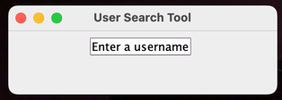
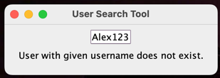
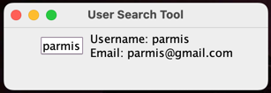
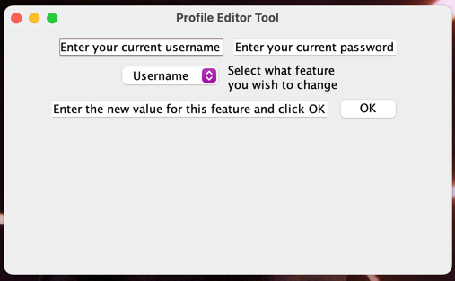
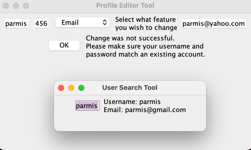
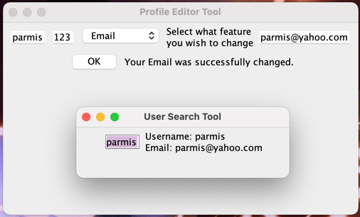
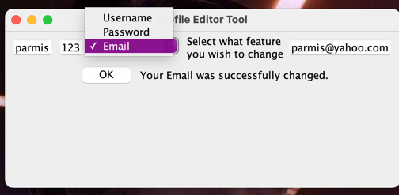

# SOLID Chat

## Our Progress (Last Updated on Nov 20)

Each of us have created one or more PRs and most of these have been merged into the main branch. Many members have functional UI's (and they are likely happy to demonstrate in tutorial) and others have a basic non-interactive UI and the inner layers of clean architecture. While they may not be able to do an interactive demo, screenshots of these user interfaces are included below.

### Chat UI
- By Nasim, James, and Amy
- The UI is rendered by ChatView
- This view will appear when a user creates a new chat or visits an existing chat

### Profile display
- By Parmis
- Implemented by UserSearchUI, which allows a user to type in a user's username to view their features (user and username so far).
- User information is captured using ChangeController interface, which uses UserDatabse interfaces to retrieve the user of interest:

- Here, Alex123 is not a user of the chat system:

- parmis is a user of the chat system though:

### Profile feature modification
- By Parmis
- Implemented by UserMdoificationUI, which allows a user to verify their authority to access their account by confirming their username and password, and then choosing the feature they wish to modify, and enter the new value for it. 
- User information is captured using UserPresenter interface, which uses UserAuthenticationI to confirm user's authority to make the change, then uses Changeable interface (use case) to make the changes to the User entity, and finally uses UserModificationGateway to relay the changed info to UserDatabase:

- Here: Parmis's password is actually 123, so she doesn't get the chance to change her email:

- as you can see, her email is unchanged.
- now she enters the right password and tries again:

- This time, change was successful. She could use this tool to similarly change her username or password too:

## Template Readme
This is a template repository for CSC 207 projects. 
This repository contains starter code for a gradle project.
It also contains workflow documents that give instructions on how to manage your Github repository and how to use Github Projects for efficient collaboration.

### Checklist For Your Project
- [ ] Verify the correct settings for your project repository
- [ ] Set up Github Projects
- [ ] Create the implementation plan using issues and Github Projects
- [ ] Create deveopment branches for your features
- [ ] Use pull requests to merge finished features into main branch
- [ ] Conduct code reviews

**If your team has trouble with any of these steps, please ask on Piazza. For example, with how GitHub Classroom works, your team *may* not have permissions to do some of the first few steps, in which case we'll post alternative instructions as needed.**

### Workflow Documents

* Github Workflow: Please refer to the workflow that was introduced in the first lab. You should follow this when working on your code. The following document provides additional details too.

* [Project Planning and Development Guide](project_plan_dev.md): This document helps you to understand how to create and maintain a project plan for your class project. **This document helps you to complete the Implementation Plan Milestone.**

### Gradle Project
Import this project into your Intellij editor. It should automatically recognise this as a gradle repository.
The starter code was built using SDK version 11.0.1. Ensure that you are using this version for this project. (You can, of course, change the SDK version as per your requirement if your team has all agreed to use a different version)

You have been provided with two starter files for demonstration: HelloWorld and HelloWorldTest.

You will find HelloWorld in `src/main/java/tutorial` directory. Right click on the HelloWorld file and click on `Run HelloWorld.main()`.
This should run the program and print on your console.

You will find HelloWorldTest in `src/test/java/tutorial` directory. Right click on the HelloWorldTest file and click on `Run HelloWorldTest`.
All tests should pass. Your team can remove this sample of how testing works once you start adding your project code to the repo.

Moving forward, we expect you to maintain this project structure. You *should* use Gradle as the build environment, but it is fine if your team prefers to use something else -- just remove the gradle files and push your preferred project setup. Assuming you stick with Gradle, your source code should go into `src/main/java` (you can keep creating more subdirectories as per your project requirement). Every source class can auto-generate a test file for you. For example, open HelloWorld.java file and click on the `HelloWorld` variable as shown in the image below. You should see an option `Generate` and on clicking this your should see an option `Test`. Clicking on this will generate a JUnit test file for `HelloWorld` class. This was used to generate the `HelloWorldTest`.

You can create another simple class and try generating a test for this class.
